# Claude Video Editing Flow


**Drop any video file. Get a short-form cut with no timeline scrubbing.**
**Claude transcribes, scores and renders. You tick the candidates.**

---

## Why This Exists

Editing long-form video by hand is slow in the wrong places. Scrubbing a 4-minute take to find the 60 seconds worth keeping — that is the part a human should stop doing. What a human _should_ do is read a short list of quote-marked segments and tick the ones that work.

This workflow splits the job the way it should be split. Claude transcribes, scores and ranks every quotable segment against a written SOP. You open a markdown sheet, tick a few boxes, and Claude renders. No timeline, no DaVinci, no color-grading per segment, no audio drift between takes.

**Selection is a human decision. Correction is a Claude decision.**

---

## Claude Video Editing Flow vs Traditional Editors

| Dimension | DaVinci / Premiere | CapCut / Descript | Claude Video Editing Flow |
|---|---|---|---|
| **Selection unit** | Scrub a timeline | Auto-cut whole clip | Read tickable quotes in markdown |
| **Human time per 4-min source** | 30–90 min | ~5 min for "good enough" auto-cut | ~5 min (2 min reading, 3 min Claude renders) |
| **Editorial control** | Total | Limited to template | High — your SOP in `SELECTION-RULES.md` |
| **Re-iteration cost** | Re-edit timeline | Regenerate, lose edits | Re-tick, render again — same source, new EDL |
| **Per-segment grade pops** | Manual fix | Auto-grade per segment (visible drift) | Single grade across all picks (no drift) |
| **Caption fidelity** | Manual or auto-generated | Built-in, mid-quality | Word-level ElevenLabs Scribe transcripts |
| **Reproducibility** | Project file lives forever | Cloud-locked | EDL + transcripts in git, replay anytime |
| **Cost per cut** | Sub + your time | Sub + caption credits | ~$0.05 ElevenLabs scribe + ffmpeg compute |

---

## What It Does

A five-stage pipeline that takes one raw `.mp4` and produces a preview cut roughly two minutes later.

```mermaid
%%{init: {'theme': 'dark', 'themeVariables': {'nodeTextColor': '#e8e8e8', 'primaryTextColor': '#e8e8e8', 'secondaryTextColor': '#cccccc', 'tertiaryTextColor': '#cccccc', 'clusterBkg': 'transparent', 'clusterBorder': '#8b949e'}}}%%

flowchart LR
    RAW["<b>Raw Footage</b><br/>Any .mp4 source"]
    SCRIBE["<b>Scribe</b><br/>ElevenLabs word-level JSON"]
    SCORE["<b>Claude Scores</b><br/>per SELECTION-RULES.md"]
    CANDIDATES["<b>candidates.md</b><br/>ranked list with ticks"]
    YOU["<b>You Tick</b><br/>reading text, not scrubbing"]
    RENDER["<b>Claude Renders</b><br/>extract → concat → eval"]
    PREVIEW["<b>preview.mp4</b><br/>plays in QuickTime / VLC"]

    RAW --> SCRIBE
    SCRIBE --> SCORE
    SCORE --> CANDIDATES
    CANDIDATES --> YOU
    YOU --> RENDER
    RENDER --> PREVIEW

    style RAW fill:none,stroke-width:1px,color:#e8e8e8
    style SCRIBE fill:none,stroke-width:1px,color:#e8e8e8
    style SCORE fill:none,stroke-width:1px,color:#e8e8e8
    style CANDIDATES fill:none,stroke-width:1px,color:#e8e8e8
    style YOU fill:none,stroke-width:1px,color:#e8e8e8
    style RENDER fill:none,stroke-width:1px,color:#e8e8e8
    style PREVIEW fill:none,stroke-width:1px,color:#e8e8e8
```



---

## Ten Things You Can Do With It

The pipeline is source-agnostic. Any single `.mp4` with recognisable speech works. Ten patterns to start with:

| # | Input | Output |
|---|-------|--------|
| 1 | Podcast episode (Riverside / Zencastr / local DAW) | 60-second shorts for TikTok / Reels / YouTube Shorts |
| 2 | Loom walkthrough | Tight 2-minute explainer with filler + silence removed |
| 3 | iPhone / Android raw clip | Vertical 9:16 reel with auto-framing rotation |
| 4 | Zoom / Teams / Meet recording | Highlights reel of the decisions + action items |
| 5 | Conference or stage-keynote footage | 90-second promo clip per session |
| 6 | Client testimonial (on-call or in-person) | 30-second sales asset per testimonial |
| 7 | YouTube long-form (unboxing / review / vlog) | Platform-specific cuts for cross-posting |
| 8 | Course module recording | Preview trailer — the hook, not the lesson |
| 9 | Live-stream replay (Twitch / YouTube Live) | Edited highlight reel, silences trimmed |
| 10 | Screen-recording tutorial | Condensed how-to with dead air removed |

Each pattern is driven by the same pipeline. The differences live in `SELECTION-RULES.md` (target runtime, framing, audio handling) — override per use case, not per clip.

---

## Install (via Claude Code)

Paste the repo URL into Claude Code and say:

> "Install Claude Video Editing Flow and run the smoke test."

Claude will walk you through:

1. **Clone both repos** into a chosen working directory:
   - `claude-video-editing-flow` (this repo — rules, scripts, session logs)
   - `video-use` (transcribe + pack dependency — separate open-source clone)
2. **Check ffmpeg** (installs via Homebrew on macOS, apt on Linux, or prompts for WSL on Windows).
3. **Prompt for an ElevenLabs API key** — stored in `.env`, used for word-level transcripts.
4. **Create the Python venv** for `video-use` and install requirements.
5. **Offer three smoke-test options** — pick one:
   - Your most recent Zoom / Teams recording → 90-second highlight
   - A Loom you recorded this week → 60-second explainer
   - Any long video you haven't edited → your choice of target runtime

If the generated `preview.mp4` plays, the pipeline is working.

### Manual install (if you prefer)

| Tool | Purpose | Install |
|------|---------|---------|
| `ffmpeg` | Extract, grade, concat | `brew install ffmpeg` (macOS) / `apt install ffmpeg` (Linux) |
| ElevenLabs API key | Word-level transcripts | Paste into `.env` in this repo |
| `video-use` | Python transcribe/pack pipeline | `git clone` alongside this repo, `python -m venv .venv`, `pip install -r requirements.txt` |
| QuickTime / VLC | Preview playback | Platform default |

**Optional:** `brew install homebrew-ffmpeg/ffmpeg/ffmpeg --with-libass` on macOS (or apt equivalent on Linux) to enable burned-in captions. Default install ships SRT as a companion file — most platforms render them fine.

---

## Quick Start

Once installed:

1. **Drop** a raw `.mp4` into a clip folder alongside the repo (e.g. `../my-clip/my-clip.mp4`).
2. **Say** "edit this clip" in Claude Code, or paste the filename.
3. **Tick** the boxes in the generated `candidates.md`.
4. **Tell** Claude "done" — the preview opens in your player ~2 minutes later.
5. **Lock it in** or re-tick for a different cut.

---

## The Candidate Sheet

Everything downstream hangs on `candidates.md`. Three tiers, each candidate quote-marked with a timestamp, a duration, and a one-line rationale.

| Tier | Meaning | How you use it |
|------|---------|----------------|
| ★★★ | Peak insight density, quotable, self-contained | Pick mostly from here |
| ★★ | Bridges, context, credibility frames | Add only if the story needs them |
| ★ | Filler beats | Rarely surfaced |

Budget check: target runtime ±10%. For a 60s clip, picks must sum to 54–66s. Over-budget flags ★★ first as drop targets; under-budget surfaces the highest-ranked unpicked candidate. Target runtime is configurable in `SELECTION-RULES.md`.

---

## Render Rules (no human decision)

Everything here is auto-applied. Locked after two render passes against the initial validation clip.

```mermaid
%%{init: {'theme': 'dark', 'themeVariables': {'nodeTextColor': '#e8e8e8', 'primaryTextColor': '#e8e8e8', 'secondaryTextColor': '#cccccc', 'tertiaryTextColor': '#cccccc', 'clusterBkg': 'transparent', 'clusterBorder': '#8b949e'}}}%%

flowchart TD
    GRADE["<b>Grade</b><br/>single neutral_punch<br/>no per-segment drift"]
    AUDIO["<b>Audio</b><br/>30ms fades at cuts<br/>loudnorm conditional"]
    FRAME["<b>Framing</b><br/>rotate 100% / 104% center /<br/>100% / 104% right"]
    ENC["<b>Encode</b><br/>CRF 20, preset fast,<br/>24fps, +faststart"]
    CAP["<b>Captions</b><br/>SRT from transcript<br/>burned optional"]

    style GRADE fill:none,stroke-width:1px,color:#e8e8e8
    style AUDIO fill:none,stroke-width:1px,color:#e8e8e8
    style FRAME fill:none,stroke-width:1px,color:#e8e8e8
    style ENC fill:none,stroke-width:1px,color:#e8e8e8
    style CAP fill:none,stroke-width:1px,color:#e8e8e8
```



| Rule | Why |
|------|-----|
| Single grade across all segments | Per-segment auto-grade causes visible pops |
| Loudnorm is **conditional** | Skip if source was mixed in a DAW (Riverside / Logic / Audition — already balanced). Enable for raw phone, camera, Zoom / Teams captures where levels drift. `SELECTION-RULES.md` flags your source type. |
| 30ms fades at every cut | Prevents audio pops |
| Framing rotation | Multi-cam feel from single-cam source (4% scale only, no motion) |
| CRF 20 full render | `--preview` mode gives GOP artefacts at segment boundaries |
| SRT not burned by default | Homebrew ffmpeg lacks libass on many installs; burned captions are an opt-in |

Full rule set lives in [`SELECTION-RULES.md`](SELECTION-RULES.md).

---

## File Structure

```
Claude-Video-Editing-Flow/
  README.md                  # This file
  CLAUDE.md                  # Project rules
  MASTER-LOG.md              # Session log + kickoff prompt
  SELECTION-RULES.md         # The SOP
  scripts/
    render_v2.sh             # Reference renderer (per-clip)
    render.py                # Generalised renderer (any EDL, any format)
    batch.py                 # Folder → assets-library orchestrator
  reference/
    pipeline.md              # End-to-end walk-through
  sessions/
    <date>-<clip-name>.md    # One markdown per processed clip
  .claude/
    skills/
      claude-video-editing-flow/
        SKILL.md             # Intent routing + step list
```

### Per-Clip Working Folder

Clip folders live **outside** this repo. Each one gets:

```
<clip-name>/
  <clip-name>.mp4            # Source video
  edit/
    transcripts/<name>.json  # Scribe cache
    takes_packed.md          # Phrase-level transcript
    candidates.md            # Ranked picks (you tick)
    edl.json                 # EDL built from ticks
    preview.mp4              # Final render
    master.srt               # Caption companion file
```

This separation keeps raw footage out of the repo's git history and lets you run the pipeline over dozens of clips without bloating the project.

---

## What If...

### ...I don't know what makes a good cut?

`SELECTION-RULES.md` is the SOP. Tier 1 (★★★) is peak insight density. Tier 2 (★★) is bridges and context. Tier 3 (★) is filler. Tick mostly from Tier 1 — the budget logic surfaces overflows.

### ...the source is multi-cam?

Multi-cam alignment isn't shipped yet. Today, run the pipeline per cam, pick from each, manually concat the EDLs. Multi-cam alignment is on the roadmap.

### ...I need a vertical 9:16 cut?

Add a `vertical` flag in `SELECTION-RULES.md` and the framing rotation switches to crop + scale per-segment. Same EDL, vertical render.

### ...the audio drifts between segments?

Set the source as `raw_phone` / `zoom` / `camera` in `SELECTION-RULES.md` to enable conditional `loudnorm`. Don't enable it for Riverside / Logic / Audition exports — they're already balanced.

### ...I want a teammate or VA to run selections?

The candidate sheet is just markdown. Anyone reading English can tick. No editing software needed. Lock `SELECTION-RULES.md` to your house style and they'll converge on your taste over time.

---

## Known Gaps + Roadmap

| Working | Not Yet |
|---------|---------|
| Scribe transcripts (word-level) | Multi-speaker alignment across multi-cam |
| Candidate scoring with tiered ranking | Per-voice style overrides |
| Single-grade render with framing rotation | Burned captions (needs libass ffmpeg) |
| 30ms fades at cuts | Multi-source audio normalisation for raw captures |
| CRF 20 full-quality pipeline | Vertical 9:16 variant shipped — overrides per use case still open |
| Selection-first (candidates → ticks → render) | Multi-clip batch processing (prototype in `batch.py`) |

---

## Build Timeline

| Milestone | What |
|-----------|------|
| v1 | Five-stage pipeline locked. Initial validation on a 4-minute podcast source. Candidate-sheet workflow extracted. Selection rules locked. |
| v1.1 | Generalised renderer (`render.py`). EDL-driven, format-agnostic (horizontal / vertical). |
| v1.2 | Autonomous batch mode (`batch.py`). Folder-of-`.mp4`s → assets library with zero-interaction picks (prototype mode). |

---

## Repos

| Repo | What |
|---|---|
| [`claude-video-editing-flow`](https://github.com/sellersessions/claude-video-editing-flow) | This repo — selection-led short-form cuts. |
| [`claude-remotion-flow`](https://github.com/sellersessions/claude-remotion-flow) | Programmatic video production. Treatment-driven, beat-synced. |
| [`claude-ui-workflow`](https://github.com/sellersessions/claude-ui-workflow) | Design intelligence pipeline — turn inspiration into production UI. |

Built on top of [`ClaudeFlow-Agent`](https://github.com/sellersessions/ClaudeFlow-Agent) — the personal AI operating system that ties them together.

---

*5 pipeline stages · source-agnostic · terminal-first · selection-led.*
