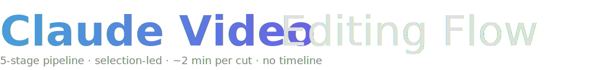
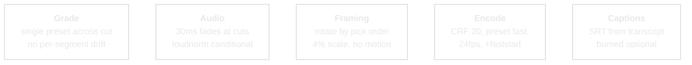

<picture>
  <source media="(prefers-color-scheme: dark)" srcset="assets/logo-dark.svg">
  <source media="(prefers-color-scheme: light)" srcset="assets/logo-light.svg">
  
</picture>

<br/>


**Drop any video file. Get a short-form cut with no timeline scrubbing.**
**Claude transcribes, scores and renders. You tick the candidates.**

<!-- VIDEO PLACEHOLDER: swap this block for the YouTube embed once recorded -->
> **Walkthrough video coming soon.**
<!-- /VIDEO PLACEHOLDER -->

---

## Why this exists

Editing long-form video by hand is slow in the wrong places. Scrubbing a 4-minute take to find the 60 seconds worth keeping: that is the part a human should stop doing. What a human _should_ do is read a short list of quote-marked segments and tick the ones that work.

This workflow splits the job the way it should be split. Claude transcribes, scores and ranks every quotable segment against a written SOP. You read a coloured terminal table, reply with a combo letter or a number list, and Claude renders. No timeline, no DaVinci, no colour-grading per segment, no audio drift between takes.

**Selection is a human decision. Correction is a Claude decision.**

---

## Claude Video Editing Flow vs Traditional Editors

| Dimension | DaVinci / Premiere | CapCut / Descript | Claude Video Editing Flow |
|---|---|---|---|
| **Selection unit** | Scrub a timeline | Auto-cut whole clip | Read a tickable terminal table |
| **Human time per 4-min source** | 30 to 90 min | ~5 min for "good enough" auto-cut | ~5 min (2 min reading, 3 min Claude renders) |
| **Editorial control** | Total | Limited to template | High. Your SOP in `SELECTION-RULES.md` |
| **Re-iteration cost** | Re-edit timeline | Regenerate, lose edits | Re-tick, render again. Same source, new EDL |
| **Per-segment grade pops** | Manual fix | Auto-grade per segment (visible drift) | Single grade across all picks (no drift) |
| **Boundary safety** | Manual scrub for clean cuts | Automatic, no audit | Pre-render Gate 1 + Gate 2 catch bleeds and trailing ends |
| **Caption fidelity** | Manual or auto-generated | Built-in, mid-quality | Word-level ElevenLabs Scribe transcripts |
| **Reproducibility** | Project file lives forever | Cloud-locked | EDL JSON + transcripts in git, replay anytime |
| **Cost per cut** | Sub + your time | Sub + caption credits | ~$0.05 ElevenLabs Scribe + ffmpeg compute |

---

## What it does

A five-stage pipeline that takes one raw `.mp4` and produces a preview cut roughly two minutes later.

```mermaid
%%{init: {'theme': 'dark', 'themeVariables': {'nodeTextColor': '#e8e8e8', 'primaryTextColor': '#e8e8e8', 'secondaryTextColor': '#cccccc', 'tertiaryTextColor': '#cccccc', 'clusterBkg': 'transparent', 'clusterBorder': '#8b949e'}}}%%

flowchart LR
    RAW["<b>Raw Footage</b><br/>Any .mp4 source"]
    SCRIBE["<b>Scribe</b><br/>ElevenLabs word-level JSON"]
    SCORE["<b>Claude Scores</b><br/>per SELECTION-RULES.md"]
    PICKER["<b>Terminal Picker</b><br/>ranked, coloured, tickable"]
    YOU["<b>You Reply</b><br/>combo letter or numbers"]
    GATES["<b>Pre-render Gates</b><br/>boundary + close check"]
    RENDER["<b>Claude Renders</b><br/>extract, grade, concat"]
    PREVIEW["<b>preview.mp4</b><br/>opens in QuickTime"]

    RAW --> SCRIBE
    SCRIBE --> SCORE
    SCORE --> PICKER
    PICKER --> YOU
    YOU --> GATES
    GATES --> RENDER
    RENDER --> PREVIEW

    style RAW fill:none,stroke-width:1px,color:#e8e8e8
    style SCRIBE fill:none,stroke-width:1px,color:#e8e8e8
    style SCORE fill:none,stroke-width:1px,color:#e8e8e8
    style PICKER fill:none,stroke-width:1px,color:#e8e8e8
    style YOU fill:none,stroke-width:1px,color:#e8e8e8
    style GATES fill:none,stroke-width:1px,color:#e8e8e8
    style RENDER fill:none,stroke-width:1px,color:#e8e8e8
    style PREVIEW fill:none,stroke-width:1px,color:#e8e8e8
```



---

## Ten Things You Can Do With It

The pipeline is source-agnostic. Any single `.mp4` with recognisable speech works. Ten patterns to start with:

| # | Input | Output |
|---|-------|--------|
| 1 | Podcast episode (Riverside / Zencastr / local DAW) | 60-second shorts for TikTok / Reels / YouTube Shorts |
| 2 | Loom walkthrough | Tight 2-minute explainer with filler and silence removed |
| 3 | iPhone / Android raw clip | Vertical 9:16 reel with auto-framing rotation |
| 4 | Zoom / Teams / Meet recording | Highlights reel of the decisions and action items |
| 5 | Conference or stage-keynote footage | 90-second promo clip per session |
| 6 | Client testimonial (on-call or in-person) | 30-second sales asset per testimonial |
| 7 | YouTube long-form (unboxing / review / vlog) | Platform-specific cuts for cross-posting |
| 8 | Course module recording | Preview trailer. The hook, not the lesson |
| 9 | Live-stream replay (Twitch / YouTube Live) | Edited highlight reel, silences trimmed |
| 10 | Screen-recording tutorial | Condensed how-to with dead air removed |

Each pattern is driven by the same pipeline. Differences live in `SELECTION-RULES.md` (target runtime, framing, audio handling). Override per use case, not per clip.

---

## Install (via Claude Code)

Paste the repo URL into Claude Code and say:

> "Install Claude Video Editing Flow and run the smoke test."

Claude will walk you through:

1. **Clone both repos** into a chosen working directory:
   - `claude-video-editing-flow` (this repo: rules, scripts, session logs)
   - `video-use` (transcribe + pack dependency, separate open-source clone)
2. **Check ffmpeg** (installs via Homebrew on macOS, apt on Linux, or prompts for WSL on Windows).
3. **Prompt for an ElevenLabs API key**. Stored in `.env`, used for word-level transcripts.
4. **Create the Python venv** for `video-use` and install requirements.
5. **Offer three smoke-test options**. Pick one:
   - Your most recent Zoom / Teams recording, target 90-second highlight
   - A Loom you recorded this week, target 60-second explainer
   - Any long video you have not edited, your choice of target runtime

If the generated `preview.mp4` plays, the pipeline is working.

### Manual install (if you prefer)

| Tool | Purpose | Install |
|------|---------|---------|
| `ffmpeg` | Extract, grade, concat | `brew install ffmpeg` (macOS) / `apt install ffmpeg` (Linux) |
| ElevenLabs API key | Word-level transcripts | Paste into `.env` in this repo |
| `video-use` | Python transcribe / pack pipeline | `git clone` alongside this repo, `python -m venv .venv`, `pip install -r requirements.txt` |
| QuickTime / VLC | Preview playback | Platform default |

**Optional:** `brew install homebrew-ffmpeg/ffmpeg/ffmpeg --with-libass` on macOS (or apt equivalent on Linux) to enable burned-in captions. Default install ships SRT as a companion file. Most platforms render them fine.

---

## How it works

Three operator surfaces. Install once, then loop the second and third per clip.

| Surface | What you do | Where it lives |
|---|---|---|
| **Install** | Clone, key, smoke test | One-off, see install above |
| **Terminal picker** | Read ranked candidates, reply with picks | `scripts/picker.py` |
| **Render rules** | Locked in `SELECTION-RULES.md`, no per-clip decision | Auto-applied |

### Quick start

Once installed:

1. **Drop** a raw `.mp4` into a clip folder alongside the repo (e.g. `../my-clip/my-clip.mp4`).
2. **Say** "edit this clip" in Claude Code, or paste the filename.
3. **Reply** in the terminal with picks: a combo letter, a number list, or natural language.
4. **Sign off** the lock-in panel and any boundary fixes.
5. **Watch** the preview open in QuickTime ~2 minutes later. Lock it in or re-tick.

---

## Terminal-first interface

Markdown files (`candidates.md`, `edl.json`) are git-tracked artefacts for reproducibility. The interface is three coloured terminal tables. You never open a file to tick a box.

| Surface | Purpose | When it appears |
|---|---|---|
| `scripts/picker.py` | Ranked candidate table with tier stars, flags, combos and a target-check colour gate. | After Claude scores, before you pick. |
| `scripts/lockin.py` | Confirmation panel. Green if total is within target tolerance, red if not. | After you reply with picks, before render. |
| `scripts/verdict.py` | Four-lane post-render decision: `a` accept, `b` re-frame, `c` re-flow, `d` re-pick. | After the preview opens in QuickTime. |

Reply in natural language. A combo letter (`A`), a number list (`1 4 6 9`), an exclusion (`skip 3`), or free text (`cut the gibberish`). No file hunting, no box ticking, no re-autonomous picking by Claude.

---

## The Candidate Sheet

Everything downstream hangs on the candidate set. Three tiers, each candidate quote-marked with a timestamp, a duration, and a one-line rationale.

| Tier | Meaning | How you use it |
|------|---------|----------------|
| ★★★ | Peak insight density, quotable, self-contained | Pick mostly from here |
| ★★ | Bridges, context, credibility frames | Add only if the story needs them |
| ★ | Filler beats | Rarely surfaced |

Budget check: target runtime ±10%. For a 60s clip, picks must sum to 54 to 66s. Over-budget flags ★★ first as drop targets. Under-budget surfaces the highest-ranked unpicked candidate. Mutually exclusive picks (tight + full versions of the same beat) trigger a warning. Target runtime is configurable in `SELECTION-RULES.md`.

---

## Pre-render gates

Two automatic checks run after lock-in and before render. Either failing pauses the cut until you sign off the proposed fix.

| Gate | What it catches |
|---|---|
| **Gate 1: Boundary review** | Reads ±1.5s of word-level Scribe JSON around every cut. Rejects mid-word starts, mid-syllable ends, and tail-word bleed-ins from the prior phrase. |
| **Gate 2: Close check** | The final pick must land. Acceptable closes: quotable payoff, decision or callback, natural sign-off, thesis restatement at lower tempo. Trailing ends are rejected. |

Both gates are derived from real corrections during the initial validation pass and live in `SELECTION-RULES.md`. Reference incident: v3 of `pod-test-claude` ended on `live with the voice a bit`. v4 trimmed to `It can write them.` with a clean payoff landing.

---

## Render Rules (no human decision)

Everything here is auto-applied. Locked after two render passes against the initial validation clip.



| Rule | Why |
|------|-----|
| Single grade across all segments | Per-segment auto-grade causes visible pops |
| Loudnorm is **conditional** | Skip if source was mixed in a DAW (Riverside, Logic, Audition: already balanced). Enable for raw phone, camera, Zoom or Teams captures where levels drift. `SELECTION-RULES.md` flags your source type. |
| 30ms fades at every cut | Prevents audio pops |
| Framing rotation | Multi-cam feel from single-cam source. 4% scale only, no motion |
| CRF 20 full render | `--preview` mode gives GOP artefacts at segment boundaries |
| SRT not burned by default | Homebrew ffmpeg lacks libass on many installs. Burned captions are an opt-in |

Full rule set lives in [`SELECTION-RULES.md`](SELECTION-RULES.md).

### Grade presets

Single grade across the cut, never per-segment. Three presets ship today.

| Preset | When to use | Look |
|--------|-------------|------|
| `neutral_punch` (default) | Talking-head, podcast, Loom | Contrast 1.06, subtle S-curve, no colour shift |
| `screen_punch` | Browser, dashboard, UI screencap | Contrast 1.12, sharper unsharp pass, slight saturation |
| `warm_cinematic` | Creative looks on explicit request | Reserved override |

Pass `--grade <preset>` to `render.py`. The default holds for the entire cut.

---

## Variants

Four framing variants ship today. Switch at render time, never per-clip in the candidate sheet.

| Variant | Output | Framing rotation |
|---|---|---|
| Horizontal talking-head (default) | 1920x1080 | 100% full, 104% center, 100% reset, 104% shifted right |
| Vertical 9:16 | 1080x1920 | Centre-column crop with 108% pseudo-tight + shifted-right cycle |
| Screen-share | 1920x1080 | Per-pick zoom 115% to 135% sampled from content position. No fixed cycle. |
| Reaction-beat | Inherits | Auto-expands reaction picks to include their setup line. One pick, not three. |

Run via:

```bash
scripts/render.py --edl <edl.json> --out <preview.mp4> --format vertical
```

Screen-share and reaction rules apply during candidate generation, not at render. Full reference in `SELECTION-RULES.md` Variants section.

---

## Batch / asset mode

For when you have a folder of raw clips and want chopped jump-cut assets for downstream composition (Claude Remotion Flow). Selection-is-human is suspended here by design. Prototype mode.

```bash
scripts/batch.py \
  --source-dir <folder-of-mp4s> \
  --assets-dir <shared-library> \
  --target 60 --tolerance 0.1 \
  --format horizontal
```

Per-clip flow inside `batch.py`:

1. Transcribe if `<clip>/edit/transcripts/<clip>.json` is missing.
2. Score: word density minus filler count (weighted 0.6x). Tiebreak on trailing-silence length.
3. Greedy pack: top-density non-overlapping segments until total falls inside `target ± tolerance`.
4. Gate 1 auto-snap: shift start off tail-word bleeds, end to nearest silence edge within ±1.5s.
5. Gate 2 landing check: if last pick's trailing silence is under 0.3s, reorder so the cleanest closer lands last.
6. Render via `render.py` and symlink the preview into `<assets-dir>/<clip>__preview_<format>.mp4`.

A `batch_summary.json` ledger lands in the assets dir alongside the previews. Use `--dry-run` to inspect picks before rendering.

---

## EDL JSON schema

The cut is replayable from `edl.json` alone. Source video, transcript, EDL: that is the project. Re-render anytime, on any host with ffmpeg.

```json
{
  "version": 1,
  "sources": {"clip": "/path/to/clip.mp4"},
  "ranges": [
    {"source": "clip", "start": 0.120, "end": 7.240,
     "beat": "HOOK",
     "quote": "If you're cloning someone else's voice...",
     "reason": "Strong opening frame."}
  ],
  "grade": "neutral_punch",
  "overlays": [],
  "total_duration_s": 60.0
}
```

Framing rotation is assigned by pick order at render time, not stored in the EDL.

---

## Additional utilities

| Script | Purpose |
|---|---|
| `scripts/render.py` | Generalised renderer. EDL-driven, format-agnostic (horizontal / vertical), grade-selectable. |
| `scripts/render_v2.sh` | Reference per-clip renderer kept for the original validation clip. Do not use for new clips. |
| `scripts/batch.py` | Folder-of-clips to assets-library orchestrator. Autonomous picks, dry-run available. |
| `scripts/loop_bed.py` | Music-bed looping. librosa downbeat detection, equal-power crossfade at seams, WAV out for Remotion composition. |
| `scripts/picker.py` / `lockin.py` / `verdict.py` | Coloured terminal tables for the three operator moments. |

---

## File Structure

```
Claude-Video-Editing-Flow/
  README.md                  # This file
  CLAUDE.md                  # Project rules
  MASTER-LOG.md              # Session log + kickoff prompt
  SELECTION-RULES.md         # The SOP
  scripts/
    render.py                # Generalised renderer (any EDL, any format)
    render_v2.sh             # Reference renderer (original pod-test-claude)
    batch.py                 # Folder to assets-library orchestrator
    loop_bed.py              # Music-bed looping for Remotion
    picker.py                # Candidate picker (coloured terminal table)
    lockin.py                # Pre-render lock-in panel
    verdict.py               # Post-render verdict table
  reference/
    pipeline.md              # End-to-end walk-through
  sessions/
    <date>-<clip-name>.md    # One markdown per processed clip
  .claude/
    skills/
      claude-video-editing-flow/
        SKILL.md             # Intent routing + step list
```

### Per-clip working folder

Clip folders live **outside** this repo. Each one gets:

```
<clip-name>/
  <clip-name>.mp4            # Source video
  edit/
    transcripts/<name>.json  # Scribe cache
    takes_packed.md          # Phrase-level transcript
    candidates.md            # Ranked picks (artefact)
    candidates.json          # Picker payload
    edl.json                 # EDL built from picks
    preview.mp4              # Final render
    master.srt               # Caption companion file
    batch_log.json           # Batch-mode picks ledger (batch only)
```

This separation keeps raw footage out of the repo's git history and lets you run the pipeline over dozens of clips without bloating the project.

ChromaDB collection `video_editing_flow_decisions` records per-clip decisions for cross-session recall.

---

## What if...

### ...I don't know what makes a good cut?

`SELECTION-RULES.md` is the SOP. Tier 1 (★★★) is peak insight density. Tier 2 (★★) is bridges and context. Tier 3 (★) is filler. Pick mostly from Tier 1. The budget logic surfaces overflows.

### ...the source is multi-cam?

Multi-cam alignment is not shipped yet. Today, run the pipeline per cam, pick from each, manually concat the EDLs. Multi-cam alignment is on the roadmap.

### ...I need a vertical 9:16 cut?

Run `render.py --format vertical`. Same EDL, vertical render. Source 1920x1080 talking-head footage is cropped to a 608x1080 subject-centric slice and scaled to 1080x1920.

### ...the source is a screen-recording?

Switch to the screen-share variant in `SELECTION-RULES.md`. Per-pick zoom is sampled from content position (115% to 135%), not the fixed 4% talking-head cycle. Pair with `--grade screen_punch` for a sharper UI look.

### ...the audio drifts between segments?

Set the source as `raw_phone`, `zoom`, or `camera` in `SELECTION-RULES.md` to enable conditional `loudnorm`. Do not enable it for Riverside, Logic, or Audition exports. They are already balanced.

### ...I want a teammate or VA to run selections?

The terminal picker is the interface. Anyone reading English can reply with a combo letter or a number list. No editing software needed. Lock `SELECTION-RULES.md` to your house style and they will converge on your taste over time.

### ...I have a folder of clips, not just one?

Run `scripts/batch.py` with `--source-dir <folder>` and `--assets-dir <library>`. Autonomous picks land jump-cut assets in your library, ready for downstream Remotion Flow composition. Use `--dry-run` first to preview the picks.

---

## Known Gaps + Roadmap

| Working | Working (prototype) | Not Yet |
|---------|--------------------|---------|
| Scribe transcripts (word-level) | Multi-clip batch processing (`batch.py`) | Multi-speaker alignment across multi-cam |
| Candidate scoring with tiered ranking | Burned captions (libass-enabled ffmpeg, opt-in) | Per-voice style overrides |
| Single-grade render with framing rotation | | Multi-source audio normalisation for raw captures |
| 30ms fades at cuts | | Per-clip override surface for the vertical variant |
| CRF 20 full-quality pipeline | | |
| Selection-first (picker, ticks, render) | | |
| Vertical 9:16 (1080x1920) | | |
| Screen-share variant with per-pick zoom | | |
| Pre-render Gate 1 (boundary review) | | |
| Pre-render Gate 2 (close check) | | |
| Three grade presets (`neutral_punch`, `screen_punch`, `warm_cinematic`) | | |
| Terminal-first picker, lock-in, verdict | | |
| Reaction-beat expansion rule | | |
| EDL-driven replay from git | | |

---

## Build Timeline

| Milestone | What |
|-----------|------|
| v1 | Five-stage pipeline locked. Initial validation on a 4-minute podcast source. Candidate-sheet workflow extracted. Selection rules locked. |
| v1.1 | Generalised renderer (`render.py`). EDL-driven, format-agnostic (horizontal / vertical). Three grade presets shipped. |
| v1.2 | Autonomous batch mode (`batch.py`). Folder-of-`.mp4`s to assets library with zero-interaction picks (prototype mode). Pre-render Gate 1 + Gate 2 auto-applied. |
| v1.3 | Terminal-first interface shipped (`picker.py`, `lockin.py`, `verdict.py`). Markdown demoted to artefact, terminal tables become the operator surface. |

---

## Companion repos

This repo ships with two siblings: same author, same operating principles, different production surface.

| Repo | What it does |
|---|---|
| [`claude-remotion-flow`](https://github.com/sellersessions/claude-remotion-flow) | Programmatic video production. Treatment-driven, beat-synced, single-stem VO. |
| [`claude-ui-workflow`](https://github.com/sellersessions/claude-ui-workflow) | Design intelligence pipeline. 10 stages from brand brief to production UI. |

All three are designed to run alongside [`ClaudeFlow-Agent`](https://github.com/sellersessions/ClaudeFlow-Agent), the personal AI operating system that ties them together.

---

*5 pipeline stages, source-agnostic, terminal-first, selection-led.*
